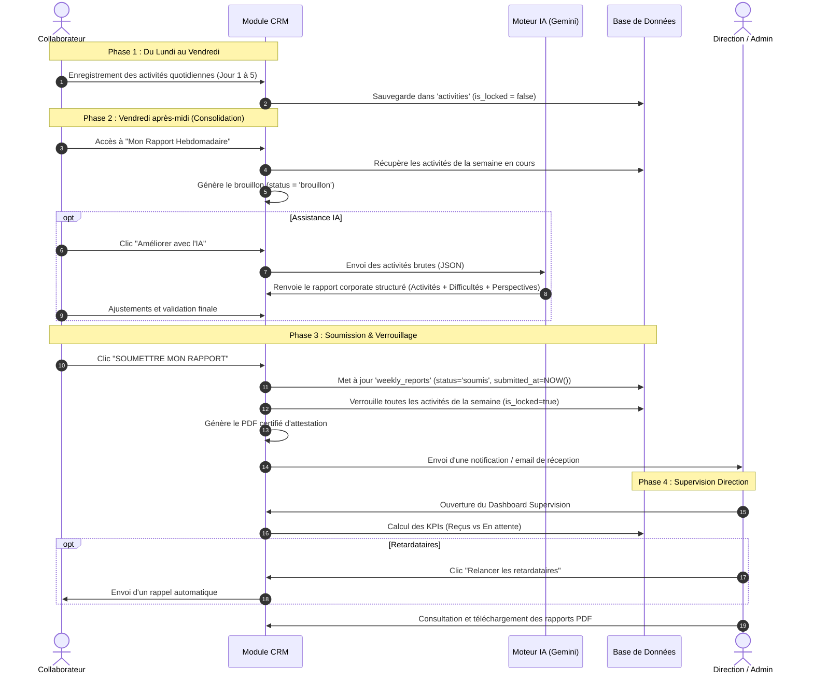

# 📑 CAHIER DES CHARGES & WORKFLOW TECHNIQUE : MODULE DE REPORTING HEBDOMADAIRE (HTR)

Ce document contient l'intégralité du cahier des charges, de l'architecture de données, des règles métier et du cycle de vie du module **Reporting Hebdomadaire d'Activité** pour une intégration directe comme sous-module au sein d'un logiciel CRM.

---

## 1. 🎯 OBJECTIFS & VALEUR AJOUTÉE DU MODULE

Le module permet d'automatiser et de digitaliser la chaîne de reporting hebdomadaire interne d'une entreprise :
1. **Saisie journalière rapide** : Les collaborateurs saisissent au fil de l'eau leurs activités du Lundi au Vendredi (titre, description, statut, catégorie).
2. **Consolidation en 1 clic** : Le système regroupe automatiquement toutes les activités de la semaine active dans un brouillon structuré.
3. **Optimisation IA (Google Gemini)** : L'IA reformule les réalisations sous forme exécutive pour la Direction et extrait les difficultés majeures et les perspectives S+1.
4. **Validation & Verrouillage d'intégrité** : Lors de la soumission, les activités de la semaine sont verrouillées (`is_locked = true`), empêchant toute falsification rétroactive.
5. **Génération d'Attestation PDF certifiée** : Production d'un document PDF corporate avec logo, photo de profil du collaborateur et horodatage certifié.
6. **Cockpit Supervision Direction** : Dashboard en temps réel affichant le taux de complétion, les rapports reçus et permettant la relance automatique des retardataires.

---

## 2. 👥 MATRICE DES RÔLES & PERMISSIONS (RBAC)

| Rôle | Périmètre et Capacités |
| :--- | :--- |
| **`collaborateur`** | • Crée, modifie et supprime ses activités quotidiennes (Lundi au Vendredi).<br>• Prépare son rapport hebdomadaire (Semaine $W$).<br>• Utilise l'assistance IA Gemini pour peaufiner son rapport.<br>• Soumet définitivement son rapport à la Direction.<br>• Télécharge son PDF et consulte l'historique de ses semaines passées. |
| **`directeur_admin`** | • Possède son propre espace collaborateur (peut soumettre ses rapports).<br>• Accède au tableau de bord de supervision de toute l'entreprise.<br>• Consulte et télécharge les rapports soumis de tous les collaborateurs.<br>• Déclenche les relances (notifications/emails) pour les collaborateurs n'ayant pas encore soumis leur rapport.<br>• Crée des comptes collaborateurs avec mot de passe temporaire 24h. |
| **`super_admin`** | • Dispose de l'ensemble des droits `directeur_admin`.<br>• Administration globale des comptes (activation/désactivation, changement de rôle, réinitialisation de mot de passe). |

---

## 3. 🗄️ SCHÉMA DE BASE DE DONNÉES (POSTGRESQL / SUPABASE)

```sql
-- 1. PROFILES (Extension des utilisateurs du CRM)
CREATE TABLE IF NOT EXISTS profiles (
  id UUID PRIMARY KEY REFERENCES auth.users(id) ON DELETE CASCADE,
  full_name TEXT NOT NULL,
  email TEXT NOT NULL UNIQUE,
  job_title TEXT,
  department TEXT DEFAULT 'HINOV Group',
  role TEXT NOT NULL DEFAULT 'collaborateur' CHECK (role IN ('collaborateur', 'directeur_admin', 'super_admin')),
  avatar_url TEXT,
  is_active BOOLEAN DEFAULT TRUE,
  must_change_password BOOLEAN DEFAULT FALSE,
  temp_password_expires_at TIMESTAMPTZ,
  custom_gemini_api_key TEXT,
  created_at TIMESTAMPTZ DEFAULT NOW(),
  updated_at TIMESTAMPTZ DEFAULT NOW()
);

-- 2. ACTIVITIES (Activités quotidiennes des collaborateurs)
CREATE TABLE IF NOT EXISTS activities (
  id UUID PRIMARY KEY DEFAULT gen_random_uuid(),
  user_id UUID NOT NULL REFERENCES profiles(id) ON DELETE CASCADE,
  date DATE NOT NULL,
  day_of_week INT NOT NULL CHECK (day_of_week BETWEEN 1 AND 5), -- 1=Lundi, ..., 5=Vendredi
  title TEXT NOT NULL,
  description TEXT,
  category TEXT DEFAULT 'Opérationnel',
  status TEXT NOT NULL DEFAULT 'terminee' CHECK (status IN ('en_attente', 'en_cours', 'terminee')),
  is_locked BOOLEAN DEFAULT FALSE,
  created_at TIMESTAMPTZ DEFAULT NOW(),
  updated_at TIMESTAMPTZ DEFAULT NOW()
);

CREATE INDEX IF NOT EXISTS idx_activities_user_date ON activities(user_id, date);

-- 3. WEEKLY_REPORTS (Rapports consolidés par semaine)
CREATE TABLE IF NOT EXISTS weekly_reports (
  id UUID PRIMARY KEY DEFAULT gen_random_uuid(),
  user_id UUID NOT NULL REFERENCES profiles(id) ON DELETE CASCADE,
  week_number INT NOT NULL,
  year INT NOT NULL,
  start_date DATE NOT NULL,
  end_date DATE NOT NULL,
  status TEXT NOT NULL DEFAULT 'brouillon' CHECK (status IN ('brouillon', 'soumis', 'archive')),
  content_snapshot JSONB NOT NULL DEFAULT '[]'::jsonb,
  difficulties JSONB NOT NULL DEFAULT '[]'::jsonb,
  perspectives JSONB NOT NULL DEFAULT '[]'::jsonb,
  pdf_url TEXT,
  submitted_at TIMESTAMPTZ,
  emailed_at TIMESTAMPTZ,
  email_recipient TEXT,
  created_at TIMESTAMPTZ DEFAULT NOW(),
  updated_at TIMESTAMPTZ DEFAULT NOW(),
  UNIQUE(user_id, week_number, year)
);

CREATE INDEX IF NOT EXISTS idx_weekly_reports_week_year ON weekly_reports(week_number, year);
CREATE INDEX IF NOT EXISTS idx_weekly_reports_status ON weekly_reports(status);

-- 4. COMPANY_SETTINGS (Paramètres corporate et modèles de rapports)
CREATE TABLE IF NOT EXISTS company_settings (
  id UUID PRIMARY KEY DEFAULT gen_random_uuid(),
  company_name TEXT NOT NULL DEFAULT 'HINOV Group',
  logo_url TEXT,
  pdf_header_image TEXT,
  pdf_footer_text TEXT DEFAULT 'Document Confidentiel Interne',
  director_email TEXT NOT NULL DEFAULT 'direction@hinovgroup.com',
  superadmin_report_recipient TEXT,
  reminder_cron TEXT DEFAULT '0 17 * * 5', -- Vendredi 17h00
  smtp_from TEXT DEFAULT 'rapports@hinovgroup.com'
);
```

---

## 4. 🔄 DIAGRAMME DU WORKFLOW MÉTIER



---

## 5. 🤖 LOGIQUE D'INTÉGRATION IA (PROMPT & STRUCTURE)

L'appel à l'API Gemini se fait via l'endpoint de complétion avec ce prompt système :

```typescript
const SYSTEM_PROMPT_IA = `
Tu es l'assistant expert en reporting corporate d'entreprise.
Ton rôle est de transformer une liste d'activités quotidiennes brutes en un rapport hebdomadaire d'activité à haute valeur ajoutée pour la Direction Générale.

Règles de formalisation :
1. Clarté, rigueur professionnelle et orientation résultat.
2. Utilise des verbes d'action corporate (ex: "Déploiement de...", "Supervision de...", "Optimisation des processus...").
3. Conserve la répartition fidèle par jour (Lundi au Vendredi).
4. Déduis 2 à 3 difficultés techniques/organisationnelles pertinentes ou points d'attention.
5. Déduis 3 à 5 perspectives et priorités concrètes pour la semaine suivante.

Format de réponse JSON strict :
{
  "activitiesByDay": {
    "1": [{"title": "string", "description": "string", "status": "terminee"}],
    "2": [{"title": "string", "description": "string", "status": "terminee"}],
    "3": [{"title": "string", "description": "string", "status": "terminee"}],
    "4": [{"title": "string", "description": "string", "status": "terminee"}],
    "5": [{"title": "string", "description": "string", "status": "terminee"}]
  },
  "difficulties": ["string", "string"],
  "perspectives": ["string", "string", "string"],
  "summary": "Synthèse exécutive en 3 phrases pour la Direction."
}
`;
```

---

## 6. 📄 STRUCTURE DU DOCUMENT PDF CERTIFIÉ

Le document PDF généré automatiquement doit contenir :
1. **Header Corporate** : Logo de l'entreprise, titre institutionnel *« RAPPORT HEBDOMADAIRE D'ACTIVITÉ »*.
2. **Encadré Collaborateur** : Photo de profil, Nom & Prénom, Fonction/Poste, Département, Période exacte (ex: *Semaine 40 du 29/09 au 03/10/2026*).
3. **Sceau & Attestation de Validation** : Badge d'intégrité avec Date/Heure de soumission et signature numérique.
4. **Tableaux Journaliers** : Détail des réalisations classées du Lundi au Vendredi.
5. **Sections Synthétiques** :
   - *Difficultés & Points de blocage rencontrés*
   - *Perspectives & Objectifs de la semaine suivante*
6. **Footer** : Mentions légales, pagination (*Page X / Y*), mention de confidentialité.

---

## 7. 🔌 API & SERVICES À BRANCHER DANS LE CRM

- `getWeeklyDraft(userId, weekNumber, year)` : Récupère ou instancie le brouillon hebdomadaire.
- `saveWeeklyDraft(reportData)` : Sauvegarde intermédiaire des modifications.
- `submitWeeklyReport(reportId, userId)` : Valide la soumission, verrouille les activités (`is_locked=true`) et déclenche le flux de notification.
- `improveWithAI(activitiesSnapshot)` : Consolidateur IA via Google Gemini.
- `getAdminSupervisionStats(weekNumber, year)` : Retourne la liste des collaborateurs avec statut (`soumis` ou `en_attente`).
- `sendReminders(pendingUserIds)` : Déclenche l'envoi de relances (push/email).
- `generateReportPDF(reportId)` : Génère et renvoie le fichier PDF binaire ou l'URL de stockage.
